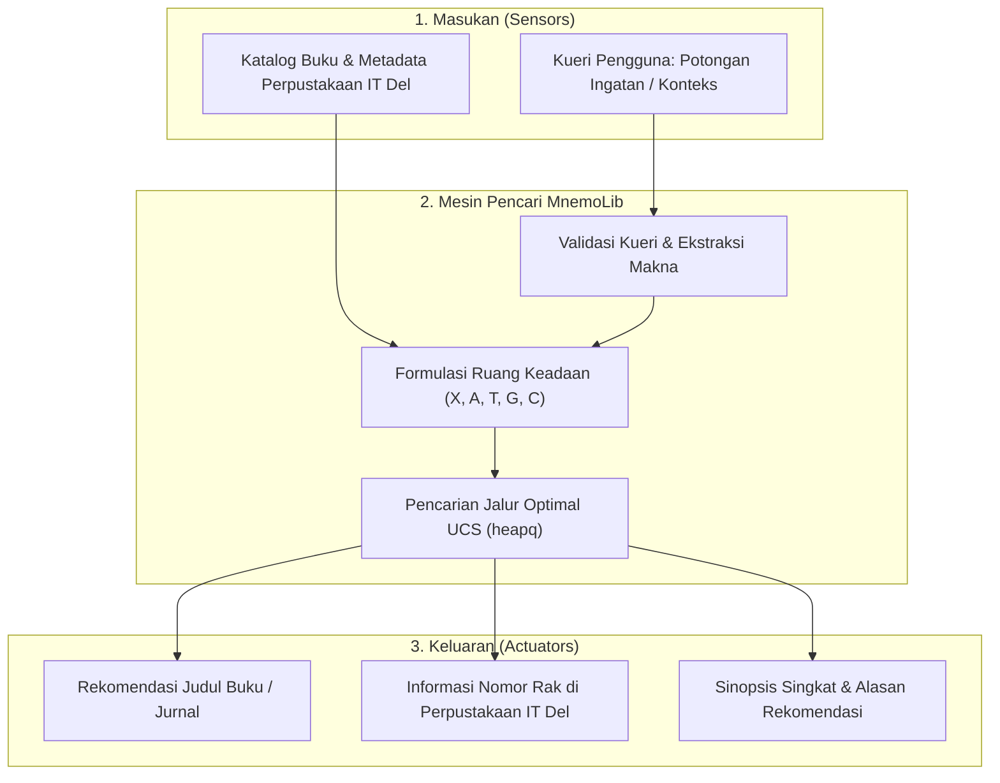

# MnemoLib

## Sistem Katalog Perpustakaan Cerdas Berbasis Contextual Match & Semantic Search untuk Identifikasi Buku dan Jurnal Melalui Potongan Ingatan Pengguna

[](https://www.python.org/)
[](https://github.com/astral-sh/uv)
[](https://pytest.org)
[](LICENSE)
[](https://www.del.ac.id/)

---

# 1. Latar Belakang

MnemoLib merupakan sistem katalog perpustakaan cerdas berbasis Artificial Intelligence yang membantu civitas akademika **Institut Teknologi Del (IT Del)** menemukan buku atau jurnal berdasarkan potongan ingatan.

Pengguna sering kali hanya mengingat sebagian informasi seperti:

- potongan judul
- karakter cerita
- topik buku
- konteks kejadian
- kata kunci tertentu

Berbeda dengan pencarian katalog konvensional yang membutuhkan keyword lengkap, MnemoLib dirancang untuk memahami informasi parsial pengguna menggunakan pendekatan **Contextual Match** dan **Semantic Search**.

---

# 2. Anggota Kelompok

| Nama | GitHub | Peran di Tim |
|---|---|---|
| Laura Sirumapea | @LauraSirumapea | **AI Architect & Model Lead** |
| Desnita Pardosi | @DesnitaPardosi | **Data & Knowledge Engineer** |
| Mia Sibuea | @MiaSibuea | **Integration & Interface Engineer** |

---

# 3. Problem Statement

Masalah utama:

1. Pengguna sulit menemukan buku ketika hanya mengingat sebagian informasi.
2. Sistem pencarian konvensional membutuhkan keyword yang spesifik.
3. Informasi berupa cerita atau konteks sulit digunakan pada pencarian tradisional.
4. Dibutuhkan sistem yang mampu mencari berdasarkan kemiripan makna dengan waktu respon cepat.

---

# 4. Spesifikasi Formal PEAS

| Komponen PEAS | Rincian |
|---|---|
| **Performance Measure** | - Search Accuracy (≥85%)<br>- Result Relevance<br>- Response Time (<1,5 detik)<br>- Search Traversal Latency (≤50 ms)<br>- User Satisfaction |
| **Environment** | Lingkungan Perpustakaan IT Del yang terdiri dari koleksi buku, jurnal, metadata koleksi, database perpustakaan, serta informasi parsial pengguna. |
| **Actuators** | Menampilkan hasil pencarian, memberikan rekomendasi buku/jurnal, menampilkan nomor rak dan metadata koleksi. |
| **Sensors** | Input teks pengguna berupa potongan judul, deskripsi cerita, karakter, lokasi kejadian, topik, dan kata kunci. |

## Klasifikasi Sifat Lingkungan Russell & Norvig

1. **Partially Observable**

   Sistem tidak memperoleh informasi lengkap karena pengguna hanya memberikan potongan ingatan.

2. **Single Agent**

   MnemoLib bertindak sebagai intelligent agent yang melakukan pencarian secara mandiri.

3. **Stochastic**

   Hasil pencarian dapat berbeda karena informasi pengguna bersifat subjektif.

4. **Sequential**

   Proses pencarian dilakukan melalui beberapa tahapan.

5. **Dynamic**

   Data koleksi perpustakaan dapat berubah.

6. **Discrete**

   Data buku, metadata, dan status pencarian direpresentasikan dalam bentuk data diskrit.

---

# 5. Diagram Arsitektur Sistem



---

# 6. Formulasi Ruang Keadaan Formal (X, A, T, G, C)

Proses pencarian MnemoLib diformulasikan menjadi lima elemen:

## X (State Space)

Kumpulan kondisi sistem:

- `start` : Memulai pencarian.
- `query_received` : Sistem menerima masukan pengguna.
- `identify_title_author` : Mengecek kemungkinan judul atau penulis.
- `extract_context` : Mengekstraksi konteks cerita.
- `identify_story_elements` : Mengidentifikasi tokoh, latar, dan alur.
- `apply_filters` : Penyaringan kategori dan tahun.
- `catalog_lookup` : Pencarian pada database katalog.
- `results_presented` : Goal state ketika hasil ditemukan.

---

## A (Actions)

Aksi yang dilakukan sistem:

- menerima query pengguna
- ekstraksi judul
- ekstraksi konteks
- pemasangan filter
- pencarian katalog
- penyajian hasil rekomendasi

---

## T (Transition Model)

Model perubahan keadaan:

\[
T(s,a) \rightarrow s'
\]

Setiap aksi akan menghasilkan perubahan status baru hingga mencapai kondisi tujuan.

---

## G (Goal Test)

Pencarian berhasil apabila:

- sistem mencapai state `results_presented`
- ditemukan minimal satu koleksi yang relevan

---

## C (Step Cost)

Estimasi biaya waktu proses:

| Transisi | Cost |
|---|---:|
| start → query_received | 5 ms |
| query_received → identify_title_author | 20 ms |
| query_received → extract_context | 45 ms |
| query_received → apply_filters | 15 ms |
| identify_title_author → catalog_lookup | 30 ms |
| extract_context → identify_story_elements | 20 ms |
| identify_story_elements → catalog_lookup | 50 ms |
| apply_filters → catalog_lookup | 40 ms |
| catalog_lookup → results_presented | 10 ms |

---

# 7. Uniform Cost Search Baseline

Pada Milestone 01, MnemoLib menggunakan **Uniform Cost Search (UCS)** sebagai algoritma baseline untuk menentukan jalur keputusan dengan total biaya waktu terendah.

Implementasi:

```text
src/mnemolib/search/

├── ucs.py
└── mnemolib_graph.py
```

---

# 8. Repository Structure

Struktur repository MnemoLib:

```text
mnemolib/

├── README.md
├── LICENSE
├── pyproject.toml
├── uv.lock

├── docs/
│   └── milestone-01/
│       ├── problem-framing.md
│       ├── peas.md
│       └── state-space.md

├── src/
│   └── mnemolib/
│       ├── __init__.py
│       └── search/
│           ├── __init__.py
│           ├── ucs.py
│           └── mnemolib_graph.py

└── tests/
    └── test_ucs.py
```

---

# 9. Panduan Menjalankan Program

## Clone Repository

```bash
git clone https://github.com/LauraSirumapea/mnemolib.git

cd mnemolib
```

## Install Dependency

```bash
uv sync
```

## Jalankan Testing

```bash
uv run pytest -v
```

## Jalankan Demo

```bash
uv run mnemolib
```

---

# 10. Lisensi

Proyek ini menggunakan **MIT License**.

Hak Cipta (c) 2026 Institut Teknologi Del - Program Studi Sarjana Sistem Informasi.