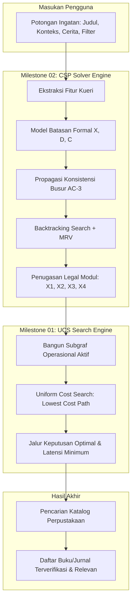

# Arsitektur Integrasi Sistem: Milestone 01 (UCS) ke Milestone 02 (CSP)
## MnemoLib — Sistem Katalog Perpustakaan Cerdas IT Del

---

## 1. Latar Belakang & Filosofi Integrasi
Pada Milestone 01, MnemoLib berfokus pada **Pencarian Jalur Inferensi Optimal** menggunakan **Uniform Cost Search (UCS)**. UCS mengeksplorasi graf ruang keadaan ingatan pengguna untuk menemukan rantai proses dengan biaya akumulatif (*latency cost*) minimum dari `start` hingga `results_presented`.

Namun, UCS bekerja berdasarkan asumsi bahwa setiap jalur yang ada secara struktural dapat dieksekusi. Di lingkungan operasional enterprise perpustakaan, terdapat batasan bisnis, dependensi modul, dan kapasitas sumber daya yang tidak dapat dimodelkan secara efisien hanya melalui bobot graf UCS.

Oleh karena itu, pada Milestone 02 ditambahkan **Constraint Satisfaction Problem (CSP) Solver**. CSP berfungsi sebagai **Mesin Pembuat Keputusan & Validasi Batasan (Decision & Constraint Validation Engine)** yang memverifikasi legalitas aktivasi modul sebelum dan sesudah jalur pencarian UCS dieksekusi.

---

## 2. Diagram Alir Integrasi (End-to-End Pipeline)

---

## 3. Pembagian Peran Komputasi

| Aspek Komputasi | Modul Milestone 01 (UCS) | Modul Milestone 02 (CSP) |
| :--- | :--- | :--- |
| **Fokus Algoritma** | Pencarian jalur berbobot biaya (*cost optimization*) | Kepuasan batasan logika & regulasi (*feasibility & constraints*) |
| **Ruang Masalah** | Graf ruang keadaan (`MNEMOLIB_SEARCH_GRAPH`) | Variabel biner keputusan $X = \{X_1, X_2, X_3, X_4\}$ |
| **Kriteria Keberhasilan** | Biaya akumulatif terendah ($\min \sum \text{edge cost}$) | Memenuhi seluruh batasan uniter, biner ($C_6$), dan global ($C_5$) |
| **Output** | Urutan jalur: misal `start -> query_received -> ...` | Konfigurasi penugasan legal: `{X1: 1, X2: 1, X3: 1, X4: 0}` |

---

## 4. Contoh Skenario Integrasi Nyata

### Kasus: Pengguna Mengingat Cerita Karakter Fiksi Ilmiah tanpa Judul
1. **Masukan Kueri**: `"Buku tentang koloni manusia di Mars yang kehabisan oksigen"`
   - `title_author = False`
   - `context = True`
   - `story = True`
   - `filter = False`
2. **Eksekusi CSP**:
   - CSP memproses batasan $C_2$ ($X_2=1$), $C_3$ ($X_3=1$), dan memvalidasi batasan biner $C_6$ ($X_3=1 \implies X_2=1$).
   - Solver mengembalikan konfigurasi legal:
     $$\{X_1: 0, X_2: 1, X_3: 1, X_4: 0\}$$
3. **Eksekusi UCS**:
   - Berdasarkan konfigurasi CSP, modul yang aktif adalah `extract_context` dan `identify_story_elements`.
   - UCS mengeksplorasi graf dan menemukan jalur optimal:
     $$\text{start} \to \text{query\_received} \to \text{extract\_context} \to \text{identify\_story\_elements} \to \text{catalog\_lookup} \to \text{results\_presented}$$
   - Total biaya latensi: $5 + 45 + 20 + 50 + 10 = 130\text{ ms}$.
4. **Hasil**: Sistem menampilkan dokumen relevan tanpa melanggar batasan dependensi operasional.

---

## 5. Kesimpulan Integrasi
Integrasi ini menjadikan MnemoLib arsitektur hibrida yang tangguh: CSP bertindak sebagai *gatekeeper* integritas bisnis yang mencegah kegagalan alur, sedangkan UCS bertindak sebagai *path optimizer* yang menjamin efisiensi latensi sistem.
